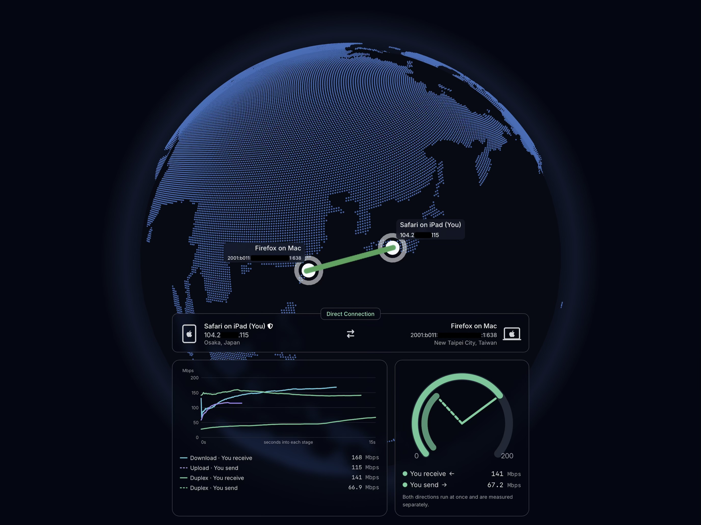
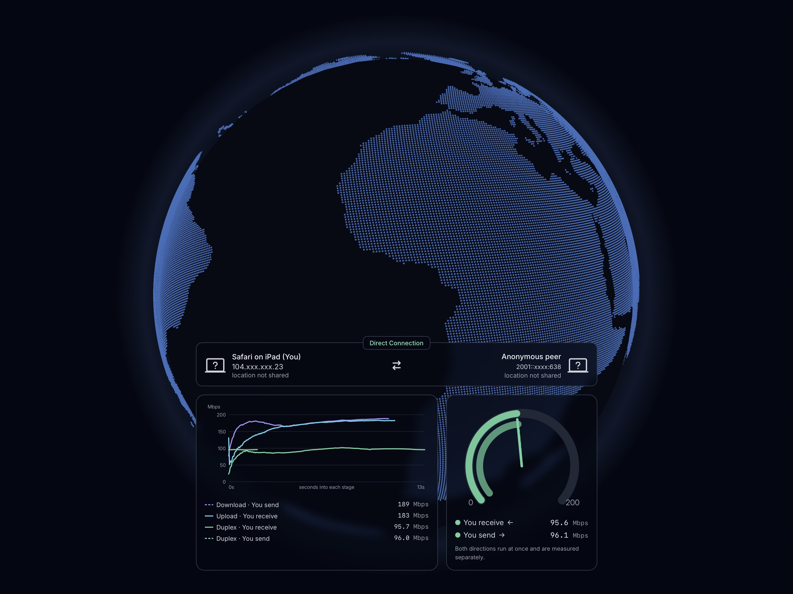

# P2P Speedtest

Browser-based P2P speedtest via WebRTC.

Most speed tests just tell you how fast you are to the nearest data center.
This project tells you how fast you actually are to the person/peer you're
connecting, calling, gaming with, or streaming to. Share a link, QR code, or emoji key,
and get a real answer in minutes — no account, no install, and nothing you
run stays on our servers.

**Try it live:** [p2ps.sws.aries0d0f.me](https://p2ps.sws.aries0d0f.me)

## Features

- Actually peer-to-peer — traffic flows directly between browsers over
  WebRTC; the server only helps you find each other.
- Direct/relay disclosure — a persistent badge always shows `DIRECT` or
  `RELAY`, never hidden or misrepresented.
- Zero setup, zero accounts — join via link, QR code, Room ID, or emoji key.
- Adjustable privacy — each peer independently chooses how much to share,
  per test.
- Local-only results — saved in your browser, with export, import, and
  shareable local links. No database, no tracking.

## When to use it

Any time it's the direct link between two specific people that matters, not
a link to a data center:

- **Online meetings & video calls** — check whether a call will hold up
  before it drops frames or breaks up.
- **Game streaming & voice chat** — confirm low, stable latency and jitter
  for co-op play or party chat.
- **Live broadcasting / peer relays** — verify sustained upload throughput
  before you go live from one peer to another.
- **Remote work & file transfers** — sanity-check real-world speed between
  a home office and a colleague or client before a big transfer.

## Screenshots

<p align="center">
  
  <br />
  <em>Normal mode. The IP address is manually blacked out for this
  screenshot only — the app itself does not mask it unless privacy mode is
  turned on.</em>
</p>

<p align="center">
  
  <br />
  <em>Anonymous mode. The peer's identity, device, and precise IP are
  withheld by the app itself.</em>
</p>

## How to use

1. Create a room and send the link, QR code, Room ID, or emoji key to
   whoever you want to test with.
2. Both of you confirm a display name and privacy level, then wait to be
   paired.
3. The test runs automatically in three stages: download, upload, and
   duplex.
4. View your result, and export, import, or share it whenever you like.

## How it works

1. Peers pair through a short-lived signaling room. The server only relays
   signaling — it never sees test traffic or results.
2. Browsers negotiate a direct, end-to-end encrypted WebRTC connection,
   falling back to TURN relay only when a direct path isn't possible.
3. Each peer sends its own name and privacy-level-gated profile (device,
   IP, geolocation) directly to the other peer over that encrypted
   connection — the server never sees it.
4. Both peers measure latency, jitter, loss, and throughput with their own
   clocks across the download, upload, and duplex stages.
5. Each browser independently assembles and stores its own result locally —
   the server is never part of that exchange.

## Privacy levels

Each peer independently picks a level before joining. It only controls what
your browser sends to the other peer — the server can still see your source
IP at the network layer regardless of level.

| Level | Name | User-agent | Device | IP | Geolocation |
|---|---|---|---|---|---|
| Off (default) | shared | shared | shared | full | full |
| On | shared | omitted | omitted | full | full |
| Anonymous | shared | omitted | omitted | masked | `proxy`/`hosting` booleans only |

- **omitted** — the field is never sent to the other peer at all.
- **masked** — the IP is sent in a coarsened/non-exact form, not the raw
  address.
- **`proxy`/`hosting` booleans only** — only whether the IP is detected as a
  proxy/VPN or hosting provider is sent; no place name or coordinates.

## Tech stack

- [React Router](https://reactrouter.com/) for the app and SSR shell
- [Cloudflare Workers](https://developers.cloudflare.com/workers/) and a
  Durable Object for lightweight signaling
- WebRTC data channels for the actual peer-to-peer measurement

## Getting started

```bash
bun install
bun run dev
```

```bash
bun run build   # production build
bun run deploy  # deploy to Cloudflare Workers
bun run test    # run the test suite
```

## License

See the repository for license details.
